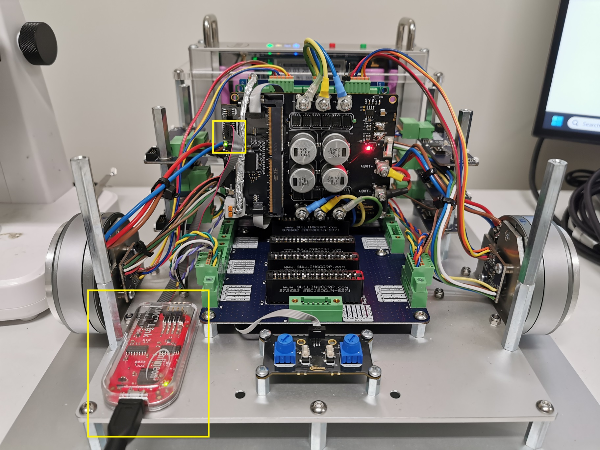
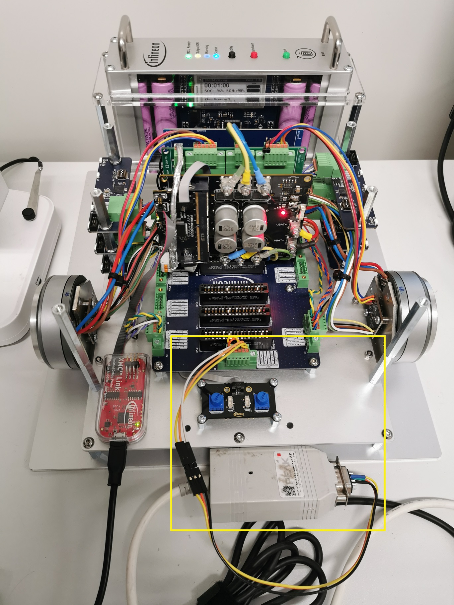

# Dual-motor control with sensored FOC code example 

 
 

## Overview

This code example demonstrates the position angle sensor-based dual motor control using the Infineon's PSOC™ Control C3 MCU and XENSIV™ TLx 5012B E1000. This code example includes the following solutions based on Rotor Field Oriented (RFO) control: 
- Sensorless PMSM FOC with 3-shunt
- GMR-based position angle sensor-based PMSM FOC

Additionally this code demonstrates CAN communication for: 
- transmitting message containing the speed and mechanical angle detected by the position angle sensor
- receiving message containing the required speed

The CAN message IDs have been specifically written for [Infineon Mobile Robot (IMR)](https://www.infineon.com/cms/en/applications/robotics/development-platform/)

[View this README on GitHub.](https://github.com/Infineon/IMR_REF_48V_2x1KW_ASFOC)

## Features

- 3.3 V 32-bit microcontroller Arm® Cortex®-M33 180 MHz PSOC™ Control C3 with 256 kB Flash and 64 kB RAM
- CAN bus communication with onboard CAN-FD transceiver
- SPI and IIF interface for two position angle sensors 
- Two motor drive power stages in one board, each providing up to 1 kW power
- 3-phase smart gate drivers, each with extensive protections (including VDS sensing), 3 current sense amplifiers, and voltage regulators 
- Disconnect switches providing Safe Torque-Off (STO) feature
- GMR-based position angle sensors for 2 motors
- Potentiometer board to provide speed input and thermistor boards to monitor the motor assemblies temperature

### Featured Infineon Products 

Following products are featured by the reference hardware:
 
 
<table style="width:100%">
  <tr>
    <th>Product</th>
    <th>Description</th>
  </tr>
  <tr>
    <td><a href="https://www.infineon.com/part/PSC3M5FDS2AFQ1">PSC3M5FDS2AFQ1</a></td>
    <td>High performance microcontroller tailored for motor control</td>
  </tr>
  <tr>
    <td><a href="https://www.infineon.com/part/TLE9250VSJ">TLE9250VSJ</a></td>
    <td>High speed CAN transceiver for CAN and CAN FD</td>
  </tr>
  <tr>
    <td><a href="https://www.infineon.com/part/TLI5012B-E1000">TLI5012B E1000</a></td>
    <td>XENSIV™ GMR-based angle sensor with SPI and incremental interface</td>
  </tr>
  <tr>
    <td><a href="https://www.infineon.com/part/6EDL7151">6EDL7151</a></td>
    <td>MOTIX™ 70 V 3-phase smart gate driver</td>
  </tr>
  <tr>
    <td><a href="https://www.infineon.com/part/1EDL8011">1EDL8011</a></td>
    <td>125 V high-side gate driver with single output in DSO-8 package for battery-powered applications</td>
  </tr>
  <tr>
    <td><a href="https://www.infineon.com/part/ISC025N08NM5LF2">ISC025N08NM5LF2</a></td>
    <td>OptiMOS™ 5 Single N-Channel Linear FET 80 V, 2.55 mΩ, 199 A in a SuperSO8 (5x6) package</td>
  </tr>
  <tr>
    <td><a href="https://www.infineon.com/part/TLI4971-A050T5-E0001">TLI4971-A050T5-E0001</a></td>
    <td>XENSIV™ high precision coreless current sensor with analog interface and dual fast over-current detection outputs</td>
  </tr>
  <tr>
    <td><a href="https://www.infineon.com/part/ISC031N08NM6">ISC031N08NM6</a></td>
    <td>OptiMOS™ 6 n-channel power MOSFET 80 V, 3.1 mΩ, 145 A in SuperSO8</td>
  </tr>
  <tr>
    <td><a href="https://www.infineon.com/part/TLE4264-2G">TLE4264-2G</a></td>
    <td>Monolithic integrated low-drop fixed voltage regulator which can supply loads up to 150 mA</td>
  </tr>
</table>

 

## Requirements

- [ModusToolbox™](https://www.infineon.com/modustoolbox) v3.5 or later
- Board support package (BSP) minimum required version: 1.0.3
- Programming language: C
- Motor control reference design board: [REF_48V_2x1KW_ASFOC](https://www.infineon.com/evaluation-board/REF-48V-2X1KW-ASFOC)
- Angle sensor boards supplied together with the above reference design or separate board e.g. [DEMO_IMR_ANGLE_SENS_V1](https://www.infineon.com/evaluation-board/DEMO-IMR-ANGLE-SENS-V1)
- Associated motor, of which motor parameters are used in this code example: [T-MOTOR GL60 KV25](https://shop.tmotor.com/products/t-motor-cubemars-gl-series-out-running-gimbal-brushless-motor-gl60-high-precision-hollow-shaft-for-gopro-aerial-photography?srsltid=AfmBOop304FnngglpV7aqp4LnRk96rERR8SXZrmy-oCN1Am3AygFbya0) or motor suggested by the user manual of the above reference design board. However please note that the motor parameters have to be adjusted accordingly. 
- Programmer and Debugger for the board e.g. [XMC™ Link](https://www.infineon.com/evaluation-board/KIT-XMC-LINK-SEGGER-V1).

## Supported toolchains (make variable 'TOOLCHAIN')

- GNU Arm&reg; Embedded Compiler v11.3.1 (`GCC_ARM`) – Default value of `TOOLCHAIN`
- IAR C/C++ Compiler v9.50.2 (`IAR`)

## Hardware setup

See the respective kit quick start guide for the hardware setup information. For details, see [User Manual of the above reference design board](https://www.infineon.com/assets/row/public/documents/24/44/infineon-reference-board-ref-48v-2x1kw-asfoc-usermanual-en.pdf).

For testing CAN communication, ensure the CAN-H and CAN-L lines of the board are connected to the [PCAN USB device](https://www.peak-system.com/Hardware.69.0.html?&L=1).

## Software setup

See the [ModusToolbox™ tools package installation guide](https://www.infineon.com/ModusToolboxInstallguide) for information about installing and configuring the tools package.

Install ModusToolbox™ Motor Suite GUI from the [Infineon Developer Center](https://www.infineon.com/idc) to evaluate the GUI features.

Install [J-Link Software](https://www.segger.com/downloads/jlink/) to allow the use of XMC™ Link to program the board and debug the software. 

For testing CAN communication, install [PCAN-View](https://www.peak-system.com/PCAN-View.242.0.html?&L=1) to view, transmit, and record the CAN data traffic in Windows-based PC. 

## Using the code example

<ol>
<li> Clone the project repository into the local drive.  
<li> Import the project with the import wizard by pressing 'File' – 'Import…'.   
    <picture>
        
    </picture>
     
    &nbsp;
</li>
<li> Select 'ModusToolbox™' – 'Import Existing Application In-Place' and press 'Next'.   
    <picture>
        
    </picture>
     
    &nbsp;
</li>
<li> Find the Project Location by pressing 'Browse…'.   
    <picture>
        
    </picture>
     
    &nbsp;
</li>
<li> Select the project folder accordingly and press 'Finish'.   
    <picture>
        
    </picture>
     
    &nbsp;
</li>
<li> Wait until the project is fully imported.   
    <picture>
        
    </picture>
     
    &nbsp;
</li>
<li> Notice that additional folder 'mtb_shared' should be created (if there was none) in addition to the project folder itself, when the import is completed.  
    <picture>
        
    </picture>
     
    &nbsp;
</li>
<li> Right click the project folder and select 'ModusToolbox™' followed by 'Library Manager 2...'.   
    <picture>
        
    </picture>
     
    &nbsp;
</li>
<li> Press the 'Update' button   
    <picture>
        
    </picture>
     
    &nbsp;
</li>
<li> When the Update is completed the sucessful messages should be displayed. If the update failed, try it again by repressing the 'Update' button. If this also fails try to clean the project, before trying it again.   
    <picture>
        
    </picture>
     
    &nbsp;
</li>
<li> Before building the project it is recommended to clean it by pressing 'Clean Project'.   
    <picture>
        
    </picture>
     
    &nbsp;
</li>
<li> If it is the first time that the motor is tested with the code without any knowledge of the position sensor offset value, ensure in HardwareIface.h, OFFSET_CAL_DONE is 0. This will set the motor control mode into Speed Mode FOC Sensorless. 
  
    <picture>
        
    </picture>
	 
    &nbsp;
</li>
<li> Finally the project can be compiled by pressing 'Build Project'.   
    <picture>
        
    </picture> 
	 
	<picture>
        
    </picture>
     
    &nbsp;
</li>
<li> To flash the board with the compiled code, first ensure that XMC™ Link ribbon cable is connected to the programming connector on the board and the board is powered with 48 VDC nominal.   
    <picture>
        
    </picture>
	 
    &nbsp;
</li>
<li> One method to flash the board can be via ModusToolbox™ Motor Suite application, which can be opened directly from ModusToolbox™ IDE. Select the Dual Motor Control project with RFO configuration and ensure the hex and elf files location are correct. 
Additionally, ensure that XMC™ Link programmer is detected and connected to the ModusToolbox™ Motor Suite application.
  
	<picture>
        
    </picture> 
	 
	<picture>
        
    </picture>
     
    &nbsp;
</li>
<li> Press the 'Flash Firmware' button to flash the compiled code into the PSOC™ Control C3 microcontroller. Locate the hex file correctly e.g. by selecting the 'Last Selected' option. Subsequently, press the next button 'Select ELF File' to allow the GUI to access the right variables for the project. 
  
	<picture>
        
    </picture> 
     
	<picture>
        
    </picture>
     
    &nbsp;
</li>
<li> Go to the Test Bench GUI to start to test the board for turning the motors. Each motor can be controlled individually by selecting the motor of interest from the drop-down list on right top corner of the Control Panel. 
Additionally, a digital Oscilloscope can also be launched by pressing the second button (orange color) on the right top corner of the GUI. This oscilloscope will help to monitor up to 8 signals of interest e.g. position angle sensor readout from both motors. 
For easy viewing of all signals, Auto Fit All Traces can be pressed to see all signals without the overlap. Sampling Clock Divider value can also be increased to allow wider time range within the screen.
  
	<picture>
        
    </picture> 
     
	<picture>
        
    </picture>
     
    &nbsp;
</li>
<li> To turn each motor, go to Command Panel, ensure that Drive is ENABLED and Potentiometer Control is OFF, and drag the slider or use the (+) button to start increasing the motor speed to desired value e.g. 40%. 
Notice in the oscilloscope that TLI_5012B_ABS_POS.Theta_TLI_5012B_flt may not well coincide with vars[0].th_r_final.elec. This means the position sensor offset value is not yet correct. Likewise, do observe for the second motor i.e. TLI_5012B_ABS_POS_M1.Theta_TLI_5012B_flt and vars[1].th_r_final.elec.
  
	<picture>
        
    </picture> 
     
	<picture>
        
    </picture>
     
    &nbsp;
</li>
<li> To find the right offset value for the position angle sensor, launch a GUI Builder by pressing the first button (green button) on the right top corner of the GUI. 
Add an input box (drag and drop) to contain the value of TLI_5012B_ABS_POS._ENC_SENSOR_OFST_S16 and remove the check for the 'Readonly', and set the minimum and maximum value to -32768 and 32767 accordingly. Add another input box for the second position sensor TLI_5012B_ABS_POS_M1._ENC_SENSOR_OFST_S16. Press the play button ('Switch to Run Mode') once it is ready to deploy in real time.
  
	<picture>
        
    </picture> 
     
	<picture>
        
    </picture>
     
    &nbsp;
</li>
<li> Change the offset value until the 2 signals of TLI_5012B_ABS_POS.Theta_TLI_5012B_flt and vars[0].th_r_final.elec fully overlap. Likewise, do the same for the second motor.
  
	<picture>
        
    </picture> 
     
	<picture>
        
    </picture> 
     
	<picture>
        
    </picture>
     
    &nbsp;
</li>
<li> Once both offset values are found, update TLI_5012B.c with the values and set OFFSET_CAL_DONE to 1 in HardwareIface.h to allow the motor control mode to be Speed Mode FOC Encoder. 
  
	<picture>
        
    </picture> 
     
	<picture>
        
    </picture>
     
    &nbsp;
</li>
<li> Rebuild the project in ModusToolbox™ IDE, and return to the ModusToolbox™ Motor Suite 'Configurator' Panel, and reflash the microcontroller with the new compiled code, and reupload the new ELF file.
  
	<picture>
        
    </picture> 
     
	<picture>
        
    </picture>
     
    &nbsp;
</li>
<li> Retest the board for the Speed Mode FOC Encoder control mode. 
  
	<picture>
        
    </picture> 
     
	<picture>
        
    </picture>
     
    &nbsp;
</li>
<li> To check for the CAN communication, first ensure the GUI_CONTROL is set to 0 in the IMR_CAN.h file. Rebuild the project, and reflash the compiled code into the microcontroller. Another method to reflash the board is by using ModusToolbox™ directly in the Quick Panel - Launches, select for <project_name> Program.   
  
	<picture>
        
    </picture>
     
    &nbsp;
</li>
<li> Plug in the PCAN-USB device into the laptop. Open PCAN-View software, and set to 1 Mbps speed. Observe in the Receive section of the PCAN-USB device, CAN-ID 400h (from Motor_0) and 401h (from Motor_1) are regularly received at 100ms period. These IDs contain the motor speed and mechanical angle position for odometry information. 
  
	<picture>
        
    </picture> 
     
	<picture>
        
    </picture> 
     
	<picture>
        
    </picture>
     
    &nbsp;
</li>
<li> To test for the CAN communication, PCAN-USB can transmit a CAN-ID 380h with 2 bytes data length e.g. [F3 34] for a speed command to Motor_0 (press ENTER key to set the CAN message, and press SPACE key to transmit the message).  
A CAN-ID 381h can be used to transmit a speed command to Motor_1 e.g. [0C CB]. 
  
	<picture>
        
    </picture> 
     
	<picture>
        
    </picture> 
     
	<picture>
        
    </picture>
     
    &nbsp;
</li>
</ol>
   
   
## Debugging

You can debug the example to step through the code.

<b>In Eclipse IDE</b>

Use the **\<Application Name> Debug (JLink)** configuration in the **Quick Panel**. For details, see the "Program and debug" section in the [Eclipse IDE for ModusToolbox™ user guide](https://www.infineon.com/MTBEclipseIDEUserGuide).

<b>In other IDEs</b>

Follow the instructions in your preferred IDE.

## Related resources

<table style="width:100%">
  <tr>
    <th>Type</th>
    <th>Links</th>
	<th>Description</th>
  </tr>
  <tr>
    <td>Application note</td>
	<td><a href="https://www.infineon.com/assets/row/public/documents/30/42/infineon-an238329-getting-started-psoc-control-c3-modustoolbox-applicationnotes-en.pdf?fileId=8ac78c8c92bcf0b0019393f072d813b5">AN238329</a></td>
    <td>Getting started with PSOC™ Control C3 MCU on ModusToolbox™ software</td>
  </tr>
  <tr>
    <td>Application note</td>
	<td><a href="https://www.infineon.com/assets/row/public/documents/30/42/infineon-an239646-pmsm-foc-psoc-control-c3-mcu-applicationnotes-en.pdf?fileId=8ac78c8c93956f5001939d61c8af4b9a">AN239646</a></td>
    <td>PMSM FOC using PSOC™ Control C3 MCU</td>
  </tr>
  <tr>
    <td>Code example</td>
	<td><a href="https://github.com/Infineon/Code-Examples-for-ModusToolbox-Software">Using ModusToolbox™</a></td>
    <td>on Github</td>
  </tr>
  <tr>
    <td>Device documentation</td>
	<td><a href="https://www.infineon.com/products/microcontroller/32-bit-psoc-arm-cortex/32-bit-psoc-control-arm-cortex-m33-mcu#documents">PSOC™ Control C3</a></td>
    <td>MCU datasheets and reference manuals</td>
  </tr>
  <tr>
    <td>Development kits</td>
	<td><a href="https://www.infineon.com/cms/en/design-support/finder-selection-tools/product-finder/evaluation-board">Evaluation board finder</a></td>
    <td>Selecting the appropriate kits</td>
  </tr>
  <tr>
    <td>Library on Github</td>
	<td><a href="https://github.com/Infineon/mtb-pdl-cat1">mtb-pdl-cat1</a></td>
    <td>Peripheral Driver Library (PDL)</td>
  </tr>
  <tr>
    <td>Library on Github</td>
	<td><a href="https://github.com/Infineon/mtb-hal-cat1">mtb-hal-cat1</a></td>
    <td>Hardware Abstraction Layer (HAL) library (XMC7200 only)</td>
  </tr>
  <tr>
    <td>Library on Github</td>
	<td><a href="https://github.com/Infineon/retarget-io">retarget-io</a></td>
    <td>Utility library to retarget STDIO messages to a UART port</td>
  </tr>
  <tr>
    <td>Tools</td>
	<td><a href="https://www.infineon.com/modustoolbox">ModusToolbox™</a></td>
    <td>ModusToolbox™ software is a collection of easy-to-use libraries and tools enabling rapid development with Infineon MCUs for applications ranging from wireless and cloud-connected systems, edge AI/ML, embedded sense and control, to wired USB connectivity using PSOC™ Industrial/IoT MCUs, AIROC™ Wi-Fi and Bluetooth® connectivity devices, XMC™ Industrial MCUs, and EZ-USB™/EZ-PD™ wired connectivity controllers. ModusToolbox™ incorporates a comprehensive set of BSPs, HAL, libraries, configuration tools, and provides support for industry-standard IDEs to fast-track your embedded application development</td>
  </tr>
</table>

 

## Other resources

Infineon provides a wealth of data at [www.infineon.com](https://www.infineon.com) to help you select the right device, and quickly and effectively integrate it into your design.

All referenced product or service names and trademarks are the property of their respective owners.

The Bluetooth® word mark and logos are registered trademarks owned by Bluetooth SIG, Inc., and any use of such marks by Infineon is under license.

PSOC™, formerly known as PSoC™, is a trademark of Infineon Technologies. Any references to PSoC™ in this document or others shall be deemed to refer to PSOC™.

---------------------------------------------------------

© Cypress Semiconductor Corporation, 2025. This document is the property of Cypress Semiconductor Corporation, an Infineon Technologies company, and its affiliates ("Cypress").  This document, including any software or firmware included or referenced in this document ("Software"), is owned by Cypress under the intellectual property laws and treaties of the United States and other countries worldwide.  Cypress reserves all rights under such laws and treaties and does not, except as specifically stated in this paragraph, grant any license under its patents, copyrights, trademarks, or other intellectual property rights.  If the Software is not accompanied by a license agreement and you do not otherwise have a written agreement with Cypress governing the use of the Software, then Cypress hereby grants you a personal, non-exclusive, nontransferable license (without the right to sublicense) (1) under its copyright rights in the Software (a) for Software provided in source code form, to modify and reproduce the Software solely for use with Cypress hardware products, only internally within your organization, and (b) to distribute the Software in binary code form externally to end users (either directly or indirectly through resellers and distributors), solely for use on Cypress hardware product units, and (2) under those claims of Cypress's patents that are infringed by the Software (as provided by Cypress, unmodified) to make, use, distribute, and import the Software solely for use with Cypress hardware products.  Any other use, reproduction, modification, translation, or compilation of the Software is prohibited.
 
TO THE EXTENT PERMITTED BY APPLICABLE LAW, CYPRESS MAKES NO WARRANTY OF ANY KIND, EXPRESS OR IMPLIED, WITH REGARD TO THIS DOCUMENT OR ANY SOFTWARE OR ACCOMPANYING HARDWARE, INCLUDING, BUT NOT LIMITED TO, THE IMPLIED WARRANTIES OF MERCHANTABILITY AND FITNESS FOR A PARTICULAR PURPOSE.  No computing device can be absolutely secure.  Therefore, despite security measures implemented in Cypress hardware or software products, Cypress shall have no liability arising out of any security breach, such as unauthorized access to or use of a Cypress product. CYPRESS DOES NOT REPRESENT, WARRANT, OR GUARANTEE THAT CYPRESS PRODUCTS, OR SYSTEMS CREATED USING CYPRESS PRODUCTS, WILL BE FREE FROM CORRUPTION, ATTACK, VIRUSES, INTERFERENCE, HACKING, DATA LOSS OR THEFT, OR OTHER SECURITY INTRUSION (collectively, "Security Breach").  Cypress disclaims any liability relating to any Security Breach, and you shall and hereby do release Cypress from any claim, damage, or other liability arising from any Security Breach.  In addition, the products described in these materials may contain design defects or errors known as errata which may cause the product to deviate from published specifications. To the extent permitted by applicable law, Cypress reserves the right to make changes to this document without further notice. Cypress does not assume any liability arising out of the application or use of any product or circuit described in this document. Any information provided in this document, including any sample design information or programming code, is provided only for reference purposes.  It is the responsibility of the user of this document to properly design, program, and test the functionality and safety of any application made of this information and any resulting product.  "High-Risk Device" means any device or system whose failure could cause personal injury, death, or property damage.  Examples of High-Risk Devices are weapons, nuclear installations, surgical implants, and other medical devices.  "Critical Component" means any component of a High-Risk Device whose failure to perform can be reasonably expected to cause, directly or indirectly, the failure of the High-Risk Device, or to affect its safety or effectiveness.  Cypress is not liable, in whole or in part, and you shall and hereby do release Cypress from any claim, damage, or other liability arising from any use of a Cypress product as a Critical Component in a High-Risk Device. You shall indemnify and hold Cypress, including its affiliates, and its directors, officers, employees, agents, distributors, and assigns harmless from and against all claims, costs, damages, and expenses, arising out of any claim, including claims for product liability, personal injury or death, or property damage arising from any use of a Cypress product as a Critical Component in a High-Risk Device. Cypress products are not intended or authorized for use as a Critical Component in any High-Risk Device except to the limited extent that (i) Cypress's published data sheet for the product explicitly states Cypress has qualified the product for use in a specific High-Risk Device, or (ii) Cypress has given you advance written authorization to use the product as a Critical Component in the specific High-Risk Device and you have signed a separate indemnification agreement.
 
Cypress, the Cypress logo, and combinations thereof, ModusToolbox, PSoC, CAPSENSE, EZ-USB, F-RAM, and TRAVEO are trademarks or registered trademarks of Cypress or a subsidiary of Cypress in the United States or in other countries. For a more complete list of Cypress trademarks, visit www.infineon.com. Other names and brands may be claimed as property of their respective owners.
